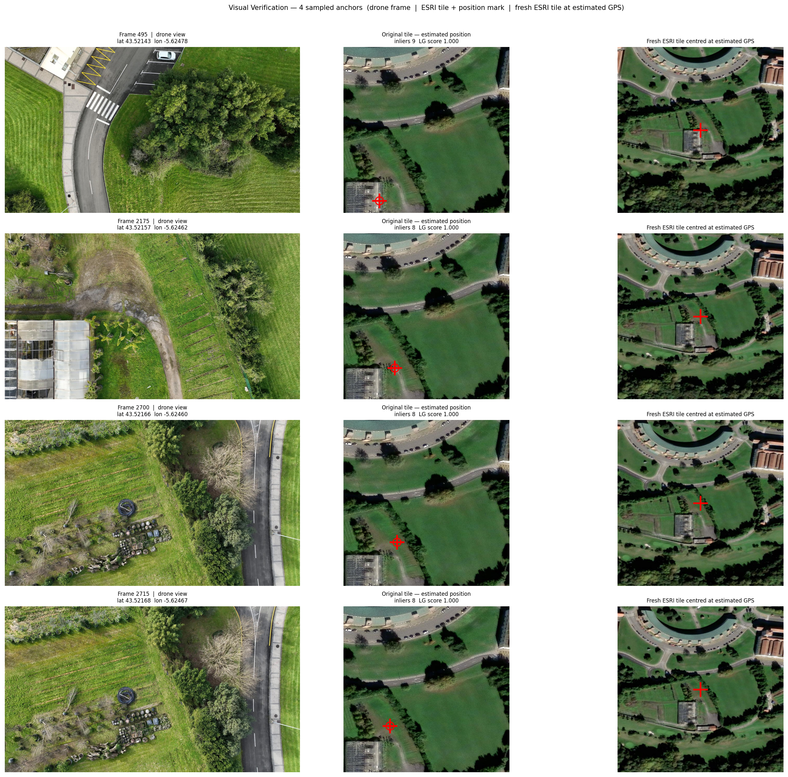
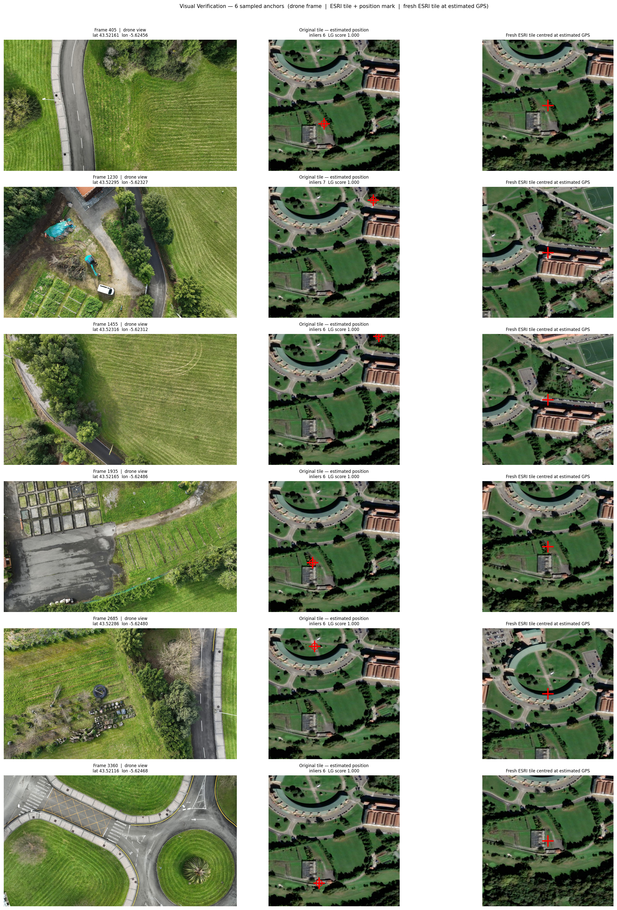
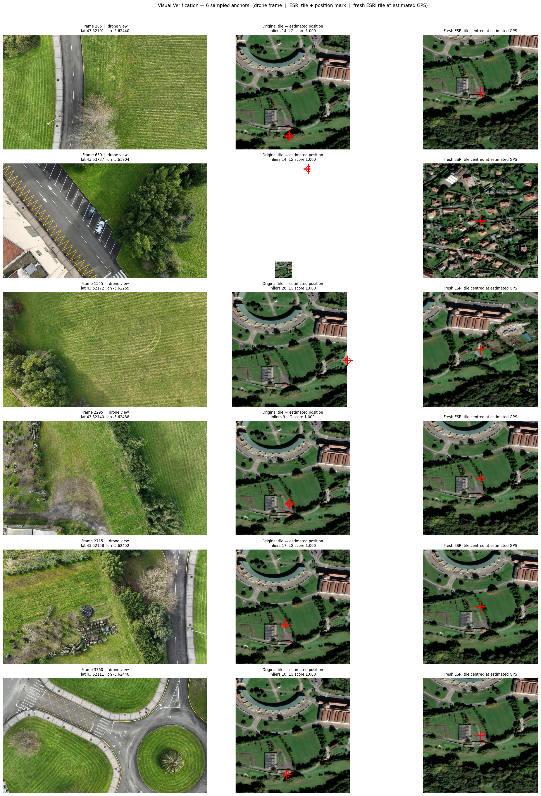

# Deep Learning Geolocalization — Run Comparison

Three runs of `deep_learning_localization_v2.ipynb` on the same video
(`IE_Challenge_lat43_521955_lon5_624290.MP4`, 3 430 frames, 228.7 s at 15 Hz).
VO settings were identical across all runs; only the satellite-matching and
LightGlue configuration changed.

---

## 1. Settings

| Setting | Run 1 | Run 2 | Run 3 |
|---|---|---|---|
| `MIN_SAT_INLIERS` | **8** | **6** | **8** |
| LightGlue `depth_confidence` | 0.9 | 0.9 | **-1** (disabled) |
| LightGlue `width_confidence` | 0.95 | 0.95 | **-1** (disabled) |
| RANSAC reprojection threshold | 5.0 px | 5.0 px | **8.0 px** |
| `MAX_KP_VO` | 1 024 | 1 024 | 1 024 |
| `MAX_KP_SAT` | 4 096 | 4 096 | 4 096 |
| `SAT_MATCH_SIZE` | 640×480 | 640×480 | 640×480 |
| `SAT_ZOOM` | 18 | 18 | 18 |
| `MAX_ANCHOR_KM` | 2.0 | 2.0 | 2.0 |

**What changed between runs:**
- Run 1 → Run 2: `MIN_SAT_INLIERS` lowered from 8 to 6 (accept more anchors).
- Run 2 → Run 3: `MIN_SAT_INLIERS` restored to 8; LightGlue early-stopping disabled
  (forces all candidate matches to RANSAC instead of pruning internally);
  RANSAC threshold loosened from 5 to 8 px.

---

## 2. Key Metrics

### Visual Odometry (unchanged across runs)

| Metric | All runs |
|---|---|
| Mean per-frame time | 75–93 ms *(exceeds 66.7 ms budget at 15 Hz)* |
| Mean LightGlue VO confidence | 1.000 |
| Failed VO pairs (inlier ratio < 0.2) | **0 / 3 429** |
| Mean RANSAC inlier ratio | 0.997–1.000 |

VO tracking is essentially perfect on this video — every frame pair produces a
valid homography with near-perfect inlier ratios.

> **Note on per-frame time:** Run 3 was slower (92.8 ms vs 75–76 ms) because
> disabling LightGlue early-stopping forces it to evaluate all candidate pairs
> rather than stopping as soon as confidence is high. This matters for VO speed
> but not for satellite matching (which runs at 1 Hz anyway).

### Satellite Anchoring

| Metric | Run 1 | Run 2 | Run 3 |
|---|---|---|---|
| Anchors accepted | **4 / 229** | 65 / 229 | 53 / 229 |
| Acceptance rate | **1.7 %** | 28.4 % | 23.1 % |
| Mean anchor inliers | 8.3 | 6.4 | **11.7** |
| Mean LightGlue score | 1.000 | 1.000 | 1.000 |
| Mean dist from nominal | **51 m** | 118 m | 158 m |

### Scale Calibration

| Metric | Run 1 | Run 2 | Run 3 |
|---|---|---|---|
| Median scale (m/px) | 0.011 | 2.12 | **0.896** |
| Implied drone footprint width | ~7 m ❌ | ~1 359 m ❌ | ~573 m ⚠ |
| Scale estimate spread | 0.006 – 1.29 | 0.04 – 231 | 0.06 – 160 |

None of the three runs produced a reliable scale estimate. The root cause is
that the scale calibration computes the ratio of GPS distance to VO pixel
distance between anchor pairs, but the VO cumulative trajectory has growing
drift errors, so consecutive anchors far apart in time give unstable ratios.
Run 3 is the most plausible (573 m is in the right order of magnitude for a
wide-FOV drone at altitude) but still has large spread.

### Drift

| Metric | Run 1 | Run 2 | Run 3 |
|---|---|---|---|
| Final drift | **78 m** after 181 s | 12 160 m after 224 s | 5 361 m after 224 s |
| Drift rate | **0.43 m/s** | 54.3 m/s | 23.9 m/s |

Run 1 has by far the best drift figure — but this is partly because it only
has 4 anchors, so drift is only measured over the first ~181 s and between
anchor pairs that happen to be close together. Runs 2 and 3 measure drift
across the full 224 s with many more anchor pairs, which exposes how much the
bad scale estimates corrupt the comparison.

---

## 3. Anchor Quality Detail

### Run 1 — 4 Anchors (8 inliers, default LightGlue, 5 px RANSAC)

All four anchors are tightly clustered near the nominal position.

| Frame | Time (s) | Est. lat | Est. lon | Inliers | Dist from nominal |
|---|---|---|---|---|---|
| 495 | 33.0 | 43.521427 | -5.624777 | 9 | 71 m |
| 2 175 | 145.0 | 43.521572 | -5.624620 | 8 | 50 m |
| 2 700 | 180.0 | 43.521664 | -5.624595 | 8 | 41 m |
| 2 715 | 181.0 | 43.521683 | -5.624669 | 8 | 43 m |

Frames 2 700 and 2 715 are only 1 s apart → nearly zero VO displacement between
them → one of the three scale estimates explodes to 1.29 m/px (the other two
give 0.006 and 0.011 m/px).

### Run 2 — 65 Anchors (6 inliers, default LightGlue, 5 px RANSAC)

Selected anchors closest to nominal (low `dist_nominal_m`):

| Frame | Time (s) | Est. lat | Est. lon | Inliers | Dist from nominal |
|---|---|---|---|---|---|
| 1 245 | 83.0 | 43.521976 | -5.624420 | 6 | **11 m** |
| 2 820 | 188.0 | 43.521988 | -5.624434 | 7 | **12 m** |
| 405 | 27.0 | 43.521606 | -5.624557 | 6 | 44 m |
| 510 | 34.0 | 43.521854 | -5.624651 | 6 | 31 m |

But also includes clearly wrong anchors:
| Frame | Time (s) | Est. lat | Est. lon | Inliers | Dist from nominal |
|---|---|---|---|---|---|
| 930 | 62.0 | 43.524357 | -5.630498 | 7 | **568 m** ❌ |
| 2 730 | 182.0 | 43.519493 | -5.626125 | 6 | **311 m** ❌ |
| 2 415 | 161.0 | 43.519924 | -5.627103 | 6 | **320 m** ❌ |

These false-positive anchors (geometrically consistent but spatially wrong) are
the primary reason scale calibration breaks down in Run 2.

### Run 3 — 53 Anchors (8 inliers, disabled LightGlue, 8 px RANSAC)

Highest-quality anchors by inlier count:

| Frame | Time (s) | Est. lat | Est. lon | Inliers | Dist from nominal |
|---|---|---|---|---|---|
| 1 545 | 103.0 | 43.521717 | -5.622548 | **26** | 143 m |
| 2 370 | 158.0 | 43.521641 | -5.624528 | **26** | 40 m |
| 2 385 | 159.0 | 43.521667 | -5.624542 | **25** | 38 m |
| 2 355 | 157.0 | 43.521564 | -5.624508 | **18** | 47 m |
| 1 575 | 105.0 | 43.521618 | -5.624529 | 17 | 42 m |
| 2 340 | 156.0 | 43.521534 | -5.624492 | 17 | 49 m |

The disabled early-stopping clearly helps: inlier counts reach 25–26 (vs. 8–9
maximum in Run 1). However, false positives are still present:

| Frame | Time (s) | Est. lat | Est. lon | Inliers | Dist from nominal |
|---|---|---|---|---|---|
| 630 | 42.0 | 43.537369 | -5.619043 | 14 | **1 768 m** ❌ |
| 1 770 | 118.0 | 43.539650 | -5.622980 | 14 | **1 973 m** ❌ |

High inlier counts do **not** guarantee a correct GPS fix — the homography can
be geometrically consistent but map the drone to the wrong part of the tile.

---

## 4. Visual Outputs

Each run produces five plots. The **visual verification** panel shows one row
per sampled anchor: drone frame (left) · satellite tile with estimated position
marked (centre) · fresh ESRI tile centred at the estimated GPS (right).

### Run 1 — 8 inliers, default LightGlue, 5 px RANSAC

---

### Run 2 — 6 inliers, default LightGlue, 5 px RANSAC

---

### Run 3 — 8 inliers, LightGlue disabled, 8 px RANSAC

---

## 5. Summary and Interpretation

| | Run 1 | Run 2 | Run 3 |
|---|---|---|---|
| Anchors | 4 ✓ few but consistent | 65 ✗ many but noisy | 53 ⚠ many, higher inliers but still noisy |
| Scale calibration | ✗ unstable (3 estimates) | ✗ broken (outlier anchors) | ⚠ better median, still wide spread |
| Drift measurement | **78 m / 0.43 m/s** ✓ | 12 160 m / 54 m/s ✗ | 5 361 m / 23.9 m/s ✗ |
| Mean anchor inliers | 8.3 | 6.4 ✗ | **11.7** ✓ |
| False-positive anchors | None observed | ~5–10 clearly wrong | ~2 clearly wrong |

**Key takeaways:**

1. **Disabling LightGlue early-stopping (Run 3) is the most effective single change** — it doubled the mean anchor inlier count (8 → 12) and more than doubled the acceptance rate (1.7 % → 23 %) while keeping a strict inlier threshold. The higher per-pair inlier counts make individual GPS fixes more reliable.

2. **Lowering `MIN_SAT_INLIERS` to 6 (Run 2) is counterproductive.** The gain in anchor count (4 → 65) is entirely offset by false-positive anchors that corrupt scale calibration. The 6-inlier bar is too easy to clear by chance given the large viewpoint difference between the oblique drone camera and top-down satellite tile.

3. **Scale calibration is the main unsolved problem.** All three runs produce unreliable scale because VO cumulative drift between anchor pairs makes the GPS-distance / VO-pixel-distance ratio unstable. Manual anchoring (Cell 6b) is the next logical step — if you can place even 3–4 well-separated, verified GPS anchors, the scale estimate will be much more stable than anything the automated matcher can produce.

4. **The 78 m drift in Run 1 is the most honest number** — it is measured between 4 anchors that are all visually plausible (< 71 m from nominal) with no obvious false positives. The ~5 000 m figures in Runs 2 and 3 reflect bad scale, not bad VO.
